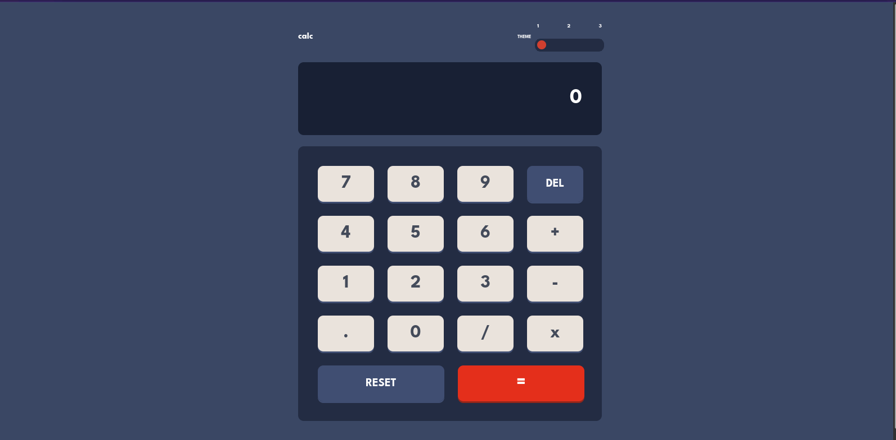

# Frontend Mentor - Calculator app solution

This is a solution to the [Calculator app challenge on Frontend Mentor](https://www.frontendmentor.io/challenges/calculator-app-9lteq5N29). Frontend Mentor challenges help you improve your coding skills by building realistic projects. 

## Table of contents

- [Overview](#overview)
  - [The challenge](#the-challenge)
  - [Screenshot](#screenshot)
  - [Links](#links)
- [My process](#my-process)
  - [Built with](#built-with)
- [Author](#author)

## Overview

### The challenge

Users should be able to:

- See the size of the elements adjust based on their device's screen size
- Perform mathmatical operations like addition, subtraction, multiplication, and division
- Adjust the color theme based on their preference
- Theme preferences are saved on Local Storage

### Screenshot

### Links

- Solution URL: [Github Respository](https://github.com/jaac97/Calculator-app)
- Live Site URL: [Calculator Page live](https://jaac97.github.io/Calculator-app/)

## My process

### Built with

- BEM
- SASS and GULP
- CSS custom properties
- Flexbox
- Mobile-first workflow

## Author

- LinkedIn - [Josué Alarcón Camino](https://www.linkedin.com/in/josue-alarcon-camino/)
- Frontend Mentor - [@jaac97](https://www.frontendmentor.io/profile/jaac97)
